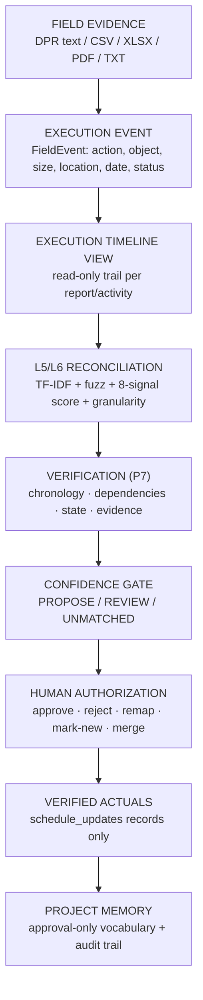

# BRIDGE-X — Execution Reality Reconstruction

> **From Field Evidence → Execution Truth.**
> Synthetic demonstration data — not real Oil India data.

A field report is not an activity update. **It is evidence of an execution event.**
BRIDGE-X doesn't simply match the report — **it reconstructs the event**: what happened, where, when, and which L5/L6 schedule activity (if any) it belongs to — then verifies, gates, and routes it to a human for authorization.



## Problem

Infrastructure projects are **planned** in structured L5/L6 schedules (Primavera-style: WBS, activities, FS dependencies, planned dates) but **executed** through messy field reports: discipline slang, abbreviations, inconsistent formats, missing dates, and different granularity than the plan.

## Core insight

> **"Don't simply match the report. Reconstruct the event."**

One report ≠ one activity. The same execution can be described five ways; five reports can describe one execution; a report can contradict schedule state entirely. BRIDGE-X therefore inserts an explicit **Execution Event** layer between evidence and schedule.

## Solution

```
FIELD EVIDENCE → EXECUTION EVENT → TIMELINE VIEW → L5/L6 RECONCILIATION
→ VERIFICATION → CONFIDENCE GATE → HUMAN AUTHORIZATION → VERIFIED ACTUALS → PROJECT MEMORY
```

| Stage | What happens | Deterministic or AI-assisted |
|---|---|---|
| Ingest | Raw text preserved verbatim (`field_reports`) | Deterministic |
| Understand | `FieldEvent` extraction — OpenRouter LLM if key set, else regex fallback | AI-assisted, Pydantic-validated, fallback always works |
| Reconcile | Alias canonicalization → TF-IDF + RapidFuzz retrieval → 8-signal weighted score → granularity verdict | Deterministic (no LLM) |
| Verify | 5 checks + variance; gate PROPOSE/REVIEW/UNMATCHED | Deterministic, authoritative |
| Authorize | Planner approve/reject/remap/mark-new/merge with force+reason gating | Human-controlled |
| Remember | Approvals teach project vocabulary; every action audited | Approval-only learning |

## Why simple report-to-activity matching is insufficient

- **Terminology differs:** site says "pipe", schedule says "spool"; "joint" vs "weld".
- **Granularity differs:** "R204 piping done" covers six activities; explicit "60% complete" must propose progress only, never completion.
- **Multiple reports describe one execution:** duplicates must be detected, mergeable, never double-counted.
- **Reports contradict schedule state:** welding claimed complete while predecessor erection never started.
- **Dependencies matter:** FS chains (`017 → 018 → 019 → 020`) constrain what can legally be claimed.
- **Some work is unplanned:** below-floor evidence proposes a *new* activity record, never a silent schedule edit.

## Core capabilities (all implemented, all demonstrable)

- Multi-format ingestion (text/CSV/XLSX/PDF/TXT) with verbatim evidence + scanned-PDF OCR refusal
- `FieldEvent` extraction with offline fallback (works with no API key)
- Explainable 8-signal matching with WHY cards (weights in `backend/app/config.py`)
- Granularity verdicts: `ONE_TO_ONE / PARTIAL / ONE_TO_MANY / NEW_UNPLANNED` (groups never auto-complete)
- P7 verification: temporal, dependency, state-machine, duplicate, contradiction + variance; errors force REVIEW
- Confidence gate: HIGH ≥85 + margin ≥15 → PROPOSE; 60–85 or margin <15 → REVIEW; <60 → UNMATCHED
- Human review: 5 gated actions, force+reason overrides, re-decision protection, full audit trail; only approvals create `schedule_updates` (plan table never overwritten)
- Project memory: approval-only vocabulary (+2.0/+1.5/+3.0, cap +5.0, thresholds unchanged) + synthetic pattern aggregates
- Read-only execution graph neighborhoods + evidence-based attention board (advisory, not predictive)
- Grounded Q&A with citations (read-only tools; LLM only summarizes retrieved facts, template composer works offline)

## Matching

TF-IDF cosine + RapidFuzz token-set retrieval (floors 0.10/40, top-10) with structured pre-filters, then an 8-signal weighted score (semantic 0.25, lexical 0.20, discipline 0.15, location 0.12, object 0.10, size/tag 0.08, WBS 0.05, state 0.05; floor 45.0). Static aliases bridge wording gaps (`pipe→spool`, `joint→weld`, `copper→cable`, `ct→cable tray`, `fdn/footing/rcc→foundation`). Approved project vocabulary adds bounded bonus evidence with `[vocab]` provenance lines. Every candidate carries per-signal WHY evidence — the UI shows *why* a match was made, and the base score is persisted separately for audit.

## Granularity

- `ONE_TO_ONE` — decisive specific evidence → may propose completion
- `PARTIAL` — explicit % → proposes progress only, never completion
- `ONE_TO_MANY` — broad report over an activity cluster → insufficient evidence, planner review, group is NEVER auto-completed
- `NEW_UNPLANNED` — below retrieval floor → proposes a new-activity record

Pure deterministic logic on the `FieldEvent` + ranked candidates. No LLM.

## Verification

Six deterministic checks (temporal, predecessor/dependency, state-machine, duplicate, contradiction, plus informational planned-vs-actual variance), all evidence and reasons preserved in `verification_results`. Any verification error forces REVIEW regardless of score. Nothing is applied to the schedule at this stage.

## Human review

Approve / reject / remap (re-verifies target) / mark-new (proposal record, never an activity row) / merge (attaches `merged_evidence`). REVIEW/UNMATCHED/invalid cases need `force=true` + written reason (else 422); re-decisions need force (else 409). Every action writes an `audit_events` row (actor, action, IDs, before/after, timestamp, reason).

## Project memory

Approvals (and planner-curated terms) teach: object mappings (`pipe→spool`), action reinforcement, phrase→activity (`"erect pipe"→PIP-204-017`), deduplicated by approval-count + source-report evidence. Nothing is learned from raw LLM output or unreviewed matches. `GET /api/memory/patterns` aggregates are all labeled synthetic.

## Execution graph

Read-only FS neighborhoods (`GET /api/graph/{code}?depth=1|2&report_code=`): predecessors, successors, second level, ordered backbone chain, stored-state and event-vs-order checks whose messages name codes, states, and the REVIEW result. P7 stays authoritative; the graph explains, never decides.

## Execution risk

Evidence-based **attention scoring, NOT predictive certainty**: signals VERIFICATION_CONFLICT:3, CONTRADICTION:3, DEPENDENCY_RISK:2, SCHEDULE_VARIANCE:2, UNMATCHED_EXECUTION:1, REPEATED_EXECUTION_ISSUE:1 (synthetic aggregates only); score capped at 10; ATTENTION (≥4 or conflict) / WATCH (≥2) / NORMAL. No probabilities, no predictions, no new tables, no mutations.

## OIL public domain knowledge

Two strictly separated classes:

| Class | Lives in | Label | Meaning |
|---|---|---|---|
| REAL_PUBLIC | `source_documents` + `domain_terms` (4 fetched sources, 49 curated terms) | `source_type='REAL_PUBLIC'` | Public Oil India terminology reference with full provenance. LLM context only. Never execution data. |
| SYNTHETIC | `field_reports` (DPR-*), `activities`, `execution_history` | `source_type='SYNTHETIC'` | Regression/demo fixtures. Never presented as real. |
| USER_PROVIDED | `field_reports` (TXT-*/ING-*) via ingest | `source_type='USER_PROVIDED'` | The only live field-execution input. |

Public documents never become DPRs, schedules, dates, or progress. The fallback parser never sees domain context (offline output byte-identical). Promotion into matching vocabulary is an explicit audited human act. Details: `docs/OIL_PUBLIC_DATA.md`.

## Technology stack

Backend: FastAPI + SQLAlchemy + SQLite, Pydantic, scikit-learn (TF-IDF), RapidFuzz, pandas/openpyxl/PyMuPDF ingestion, httpx (OpenRouter), pytest. Frontend: React 19 + Vite 8 + TypeScript + react-router-dom. CPU-only, offline-first, no embeddings, no vector DB, no background workers.

## Running locally (Windows 11, `py` launcher)

Prerequisites: Python 3.13 (`py`), Node 24 + npm.

```powershell
# one-time setup (or run scripts\setup.ps1)
Set-Location D:\SIH26122\backend
Copy-Item .env.example .env
py -m venv .venv
.\.venv\Scripts\Activate.ps1
py -m pip install -r requirements.txt
Set-Location D:\SIH26122\frontend
npm install
```

```powershell
# every time — terminal 1 (backend)
Set-Location D:\SIH26122\backend
.\.venv\Scripts\Activate.ps1
py -m uvicorn app.main:app --reload --port 8000
# health: http://127.0.0.1:8000/api/health   docs: /docs

# terminal 2 (frontend)
Set-Location D:\SIH26122\frontend
npm run dev
# UI: http://localhost:5173  (expects API at http://127.0.0.1:8000 or VITE_API_URL)
```

Demo workflow: open UI → **Reset demo data** (or `POST /api/seed`) → follow the demo scenario below. No API key needed; set `OPENROUTER_API_KEY` in `backend\.env` only to enable the optional LLM path (default free model in `.env.example`). Never commit `.env`.

## Testing (verified 2026-09-30)

- Backend: **138 tests, all green** (`.\.venv\Scripts\python.exe -m pytest -q` from `backend/`): demo 4, events 12, execution_graph 9, execution_risk 12, granularity 8, health 2, ingestion 7, matching 9, memory 9, oil_public_data 11, review 10, seed 5, time_agent 13, verification 15, vocabulary_integration 12.
- Frontend: `npm run build` clean — strict `tsc -b` + Vite, 36 modules.
- Smoke: `npm run smoke` — **29 checks pass** (2 build artifacts, 6 export unit checks, 21 live-API contracts incl. all 3 demos, gating 422s, vocab learning, cited agent answers). Requires backend on :8000.
- Known cosmetic warnings only: Starlette anyio deprecation, PyMuPDF SWIG `__module__`.

## Demo scenario (2–3 minutes, works offline)

Reset first: Overview → **Reset demo data** (or `POST /api/seed`).

1. Load demo project — Overview shows 55 activities, 35 reports, queue buckets.
2. Inspect planned L5/L6 activities — Schedule page (planned-vs-actual Gantt).
3. Ingest/select field report — Reconciliation → **Demo: Clean match** (`DPR-2026-09-18-01`: *"24 inch spool erection completed at R-204"*).
4. Extract execution event — event card (type/action/object/size/location/date, extractor badge).
5. Observe candidate match — top `PIP-204-017` with score bar + WHY signal cards.
6. Inspect confidence — `ONE_TO_ONE`, margin shown honestly (gate REVIEW on margin <15).
7. Inspect verification — valid, +6d variance detail, no errors.
8. Approve with force + reason → 422 without it (gating proven) → authorized actual + audit row + `erect spool→PIP-204-017` learned (Project Memory).
9. Ambiguity refusal — **Demo: Ambiguous** (`DPR-2026-09-19-19`): tight sub-60 cluster → `ONE_TO_MANY`, never auto-completes.
10. Contradiction — **Demo: Dependency error** (`DPR-2026-09-18-26`): verification error naming `PIP-204-018` forces REVIEW; graph backbone `017→018→019→020` explains why; risk board flags ATTENTION. Evidence Q&A → *"What conflicts were detected?"* returns cited evidence.

## Limitations / prototype scope (honest)

- All schedules, DPRs, conflicts, patterns, and seeded vocabulary origins are **synthetic fixtures**, labeled as such everywhere.
- No first-class timeline/state-machine engine — the UI shows a **read-only execution-history trail** assembled from stored rows, not a temporal reasoner.
- Scanned PDFs return `inserted: 0` + `Prototype / OCR required` (no OCR dependency by design).
- P6 XML export is a minimal prototype — validate before any production import; this is not a Primavera replacement.
- External LLM is optional and not guaranteed; the system runs fully offline in fallback + template mode.
- Single SQLite DB, single demo project, CPU-only laptop scope; no multi-project enterprise deployment.
- Relative date words ("yesterday") resolve against wall-clock date; demos use explicit dates for reproducibility.
- No browser-automation tests; UI states covered by code review + smoke contracts.
