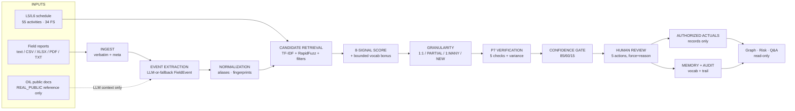

# ARCHITECTURE — BRIDGE-X Execution Reality Reconstruction

> Verified against code (`backend/app/*`, `frontend/src/*`). Nothing here is aspirational.

## End-to-end data flow

1. **Ingest** → `field_reports` row (raw text verbatim, `source_type` SYNTHETIC|USER_PROVIDED, `meta` JSON). Header aliases + 10 date formats; scanned PDF → `inserted: 0` + OCR warning.
2. **Understand** → `FieldEvent` (action, object, size/tag, location, discipline, date, status/progress, evidence + source report_id) persisted to `extracted_events` with extractor tag.
3. **Normalize + retrieve** → alias canonicalization + fingerprint → TF-IDF cosine + RapidFuzz token-set (floors 0.10/40, structured pre-filters) → top-10 candidates.
4. **Score** → 8-signal weighted sum (config weights, floor 45.0) + bounded learned-vocabulary bonus (cap +5.0, base persisted separately) → top-k with WHY lines → `match_candidates`.
5. **Granularity** → pure-function verdict attached to every run (group cap 6, cluster band 8.0, margin 5.0, high-safe 75.0).
6. **Verify + gate** → P7 result persisted to `verification_results`; gate PROPOSE/REVIEW/UNMATCHED, errors force REVIEW.
7. **Review** → human action → `schedule_updates` (before/after snapshots; `activities` provably untouched) + `review_decisions` + `audit_events` + vocabulary learning.
8. **Intelligence** → graph neighborhoods, risk board, agent answers — all derived live from the above, all read-only.

REAL_PUBLIC side flow: `source_documents`/`domain_terms` → keyword retrieval → OpenRouter LLM context + `domain_provenance`. Fallback parser never sees it. Unpromoted terms never influence matching.

## API boundaries

| Boundary | Routes | Writes |
|---|---|---|
| System/seed | `GET /api/health`, `GET /`, `POST /api/seed` | Seed wipes runtime tables; knowledge upserted, never wiped |
| Schedule reads | projects, activities(+detail), reports, conflicts, dashboard | None |
| Ingestion | `POST /api/reports`, `POST /api/reports/analyze` | `field_reports` only |
| Understanding/matching | `POST /api/events/extract`, `GET /api/events`, `POST /api/matching/run`, `GET /api/matching/{code}` | events, candidates, verification rows — never schedule |
| Review (only consequential writes) | queue, decisions, 5 POST actions, schedule-updates, audit | updates/decisions/audit/vocab, all audited |
| Memory | vocabulary GET/POST, patterns GET | approvals/curated terms only |
| Knowledge | sources, terms, lookup, promote | promote writes vocab + audit row |
| Intelligence | time-agent POST, graph GET, risk GETs | None (read-only) |

Errors: 404 unknown, 422 bad input / gating refusal, 409 no-seed / re-decision. Full reference: `docs/API_REFERENCE.md`.

## Persistence

SQLite via SQLAlchemy. 16 tables: `projects`, `wbs_nodes`, `activities`, `activity_relationships`, `field_reports` (+`meta`), `execution_history`, `conflicts`, `extracted_events`, `match_candidates` (+`base_score`/`vocab_bonus`/`vocab_hits_json`), `verification_results`, `schedule_updates`, `review_decisions`, `audit_events`, `project_vocabulary` (+`is_active`), `source_documents`, `domain_terms`. Additive `ensure_columns()` migration runs on startup/seed so existing `bridge_x.db` files upgrade safely. `POST /api/seed` is idempotent (wipe + insert synthetic baseline; knowledge upsert only).

## Deterministic vs AI-assisted

| Component | Deterministic | LLM-assisted | Read-only | Human-controlled |
|---|---|---|---|---|
| Ingestion, fallback parser | yes | no | writes reports only | no |
| OpenRouter adapter (JSON-only, 1 retry → fallback, 15 s timeout) | no | yes | no DB writes | no |
| Matching + vocab bonus | yes | no | reads | no |
| Granularity, P7, gate | yes | no | reads | no |
| Review actions | yes | no | — | **yes (actor+reason)** |
| Memory learning | yes | no | — | **yes** |
| Graph, risk, agent tools | yes | agent composes only | **yes** | no |

No embeddings, vector DBs, background workers, or external services. Heaviest compute is demo-time TF-IDF.

## Failure handling

- No API key → full fallback + template-agent mode (proven by offline test + smoke).
- LLM malformed/rate-limited/timed-out → 1 retry, then deterministic fallback; never raises to callers.
- Scanned PDF → explicit `ocr_required` refusal, never silent garbage.
- Empty DB → 409 "POST /api/seed first".
- Missing verification/target → 422; gated override without force+reason → 422; re-decision → 409; unknown codes → 404.
- Frontend: busy-guarded buttons, loading/empty/error states with retry on every page; API-offline banner.

## Provenance + audit trail

Every consequential fact carries its source: events store `report_id` + evidence text; candidates store base score, vocab hits, signals, WHY; verification stores full check outputs; `schedule_updates` store before/after snapshots; `audit_events` store actor, action, IDs, before/after, timestamp, reason. REAL_PUBLIC terms carry source_id → title/URL/publisher/dates; synthetic rows carry `synthetic`/`source_type` flags surfaced as UI badges.

## Security considerations

- `.env.example` is keyless; real keys live in gitignored `backend/.env`, never committed; health endpoint reports only `configured`/`fallback-only`, never the key.
- CORS allowlist: `localhost:5173` + `127.0.0.1:5173` only.
- Uploads: extension allowlist, empty-file rejection, size bounded by request, PDFs text-extracted (no macro/OCR execution), filenames kept in `meta` not on disk.
- DB access: parameterized ORM only, no raw SQL from user input; read-only tools for agent/graph/risk have no write path.
- Overrides (`force=true`) are first-class audited events with required reasons — not backdoors.

## Offline / fallback behavior

With empty `OPENROUTER_API_KEY`: regex fallback parser, TF-IDF/RapidFuzz matching, all gates, template agent composer, graph + risk — everything the 2-minute demo needs. Domain-knowledge context is skipped entirely, so offline output is byte-identical with or without knowledge loaded.

## Module map

`main.py` (app/lifespan/health/CORS) · `config.py` (weights, thresholds) · `db.py` (engine/session/migration) · `models.py` (16 tables) · `routers.py` (~31 routes) · `ingestion.py` · `llm/{base,fallback,openrouter}.py` · `matching/{fingerprint,candidate_retrieval,scorer,granularity,vocabulary_boost}.py` · `verification/` (P7) · `review.py` · `memory.py` · `time_agent{,_tools}.py` · `execution_graph.py` · `execution_risk.py` · `domain_knowledge.py` · `seed/{synthetic_project,oil_public_data}.py`. Frontend: 8 routed pages + shared `components.tsx` + typed `api.ts` + client-side `export.ts`; `smoke.mjs` contract suite.
